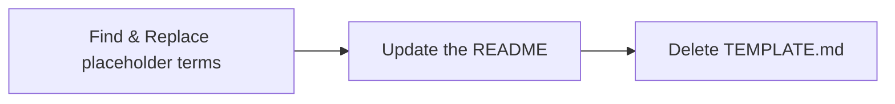

# TEMPLATE USAGE
> This template has been designed to provide a springboard or starting point for creating an API wrapper written in Python

## Getting Started

To use this template, navigate to the repository in GitHub and select `Use this template`.  For templates that have been used before, they will appear in the `Repository template` dropdown in the new repository process in GitHub.

Name the repository using the naming convention that makes sense for the use case.  For example, when building an API wrapper for a tool named 'Sprocket', use the name `sprocket_api_wrapper`

## Modifying the Template for Use

Several steps should be taken:

> is a mermaid diagram really necessary?  Of course not.  But they are awesome, so let's use one anyway

### 1. Find & Replace (VSCode: `Ctrl+Shift+h`) Targets
| Variable | Usage | Example | Notes |
|--|--|--|--|
|TOOLNAME|toolname_api.py| SPROCKET ||
|toolname|toolname_api.py| sprocket ||
|shortname|toolname_api.py| spkt ||
|ObjectClass|toolname_api.py| SprocketWidget ||
|authorname|toolname_api.py| spock ||

### 2. Update the README
Don't neglect this step!  Update the documentation to reflect the usage and nature of the API wrapper.

### 3. Delete this file (TEMPLATE.md)
Once the repository is ready for use, this file can be removed to keep the repository clean.